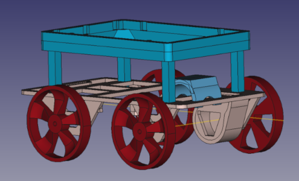

# FORRC - Free and Open RC Robot Car

Welcome to the FORRC repository! FORRC is a basic remote controlled car
that's designed to be a low cost 3d printable car to learn about building
small cars from scratch. The designs are available in FreeCAD and as
exported STL files, and the Bill Of Materials (BOM) is included based
on readily available off the shelf parts.

Note that the FreeCAD file uses the [freecad.gears](https://github.com/looooo/freecad.gears) / FCGear external workbench, available in the Addon Manager.

## Kits
Kits are also available from the Fairfield County Makers' Guild (FCMG)
close to cost, with a small markup for packing/collating and a small
donation. Any profits derived from purchasing a kit goes towards
supporting the FCMG, a 501(c)(3) nonprofit located in Norwalk, CT.
Unless you're purchasing a very large quantity of cars, the kit probably
costs less than buying all of the parts individually, but feel free
to source your own parts! At the time this was created, the kit cost a
bit less, but YMMV. Your support is always appreciated.

## Practical Info
The unmodified base car is geared down for relatively low speeed use.
Feel free to modify the design to add a higher speed motor! For
educational purposes and for the low end microcontroller included, the
lower speeds are easier on the hardware, but it's always fun to go zoom as
well.

The STL files can be loaded into a slicer such as cura but may need to be
flipped over to lie flat on the print bed. Total print time for all the
parts is around 10-20 hours depending on your printer's speed, or the
designs can be sent off to a contract print company for a nominal fee. The
full car (without a body, you'd need to design your own if you want)
takes about 30g of material (test prints were done with PLA).

## Class
If you'd like to build your car and learn about the drive mechanics in person, feel free to sign up for a class at [Fairfield County Makers' Space](https://fcmakers.com) or like minded nearby makerspaces. The course outline will be posted in due time.

## License
These designs, files, and hardware are licensed under the CERN-OHL-S v2 Open Hardware Licence - Strongly Reciprocal. See [License](LICENSE.txt) for the full license text or [CERN's Open Hardware Licence site](https://ohwr.org/cern_ohl_s_v2.txt).
